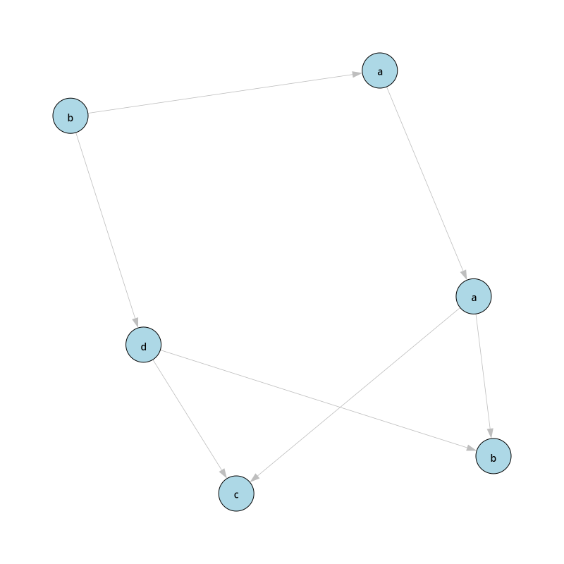
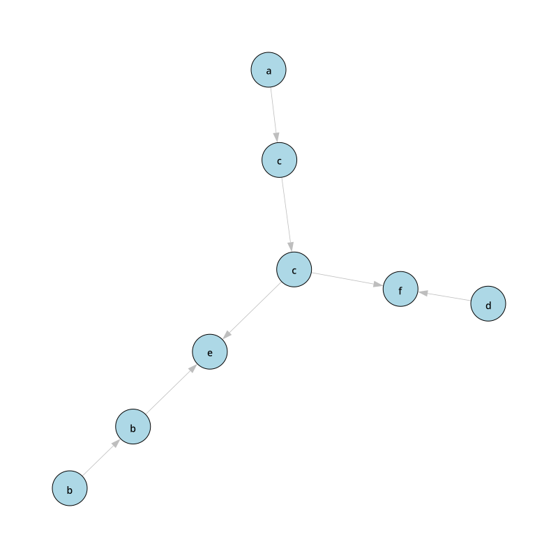

# Dependency Analysis Tool
## System requirements
- matplotlib==3.8.0
- numpy==1.26.1
- igraph==0.11.2
## Installation
To install any required packages, you can simply run this code:

    pip install -r requirements.txt

## Configuration
In directory *config* you can find [config.py](config/config.py) file.

In this file you can change input and output directories, printing and exporting options and modify labels in 
graphs.

## How to Run
To run this program, open terminal in the same directory as [dat.py](dat.py) and run this code:

    python dat.py

output:

    [USAGE]: dat.py <filename1> <filename2> ...

# Testing
To test this program with sample data, you can run program with these arguments:

    python dat.py test1 test2

output:
````
test1:
D = {(a, a), (a, b), (a, c), (b, a), (b, b), (b, d), (c, a), (c, c), (c, d), (d, b), (d, c), (d, d)}
I = {(a, d), (b, c), (c, b), (d, a)}
FNF([w]) = (b)(ad)(a)(bc)

test2:
D = {(a, a), (a, c), (a, f), (b, b), (b, e), (c, a), (c, c), (c, e), (c, f), (d, d), (d, f), (e, b), (e, c), (e, e), (f, a), (f, c), (f, d), (f, f)}
I = {(a, b), (a, d), (a, e), (b, a), (b, c), (b, d), (b, f), (c, b), (c, d), (d, a), (d, b), (d, c), (d, e), (e, a), (e, d), (e, f), (f, b), (f, e)}
FNF([w]) = (abd)(bc)(c)(ef)
````
saved plots in *output* directory:

test1:



test2:



Program can also show result plot in a separate window and save result graph in *.dot* file.

## Input file syntax
Input file must follow this **rules**:
- First line is reserved for **alphabet A** definition
- Second line is reserved for **word (trace) w**
- Rest of the lines can represent set of **transactions on variables**

### Alphabet **A**
    A = a
or
    
    A = a, b, c ...
**Action symbols** in alphabet **A** must be **lowercase or uppercase letters** from English alphabet.

### Word **w**
    w = abbd...
**Action symbols** in **w** must belong to the alphabet **A**.

### Transactions
````
a: x = 2x + 1
b: y = y1 + y2
c:
````
**Action symbols** must belong to the alphabet **A**. <br>
**Variables** must contain one **lowercase letter** from English alphabet and may have a **single digit** after the letter. <br>
**Transaction** may be empty.

All the transactions above are correct.
