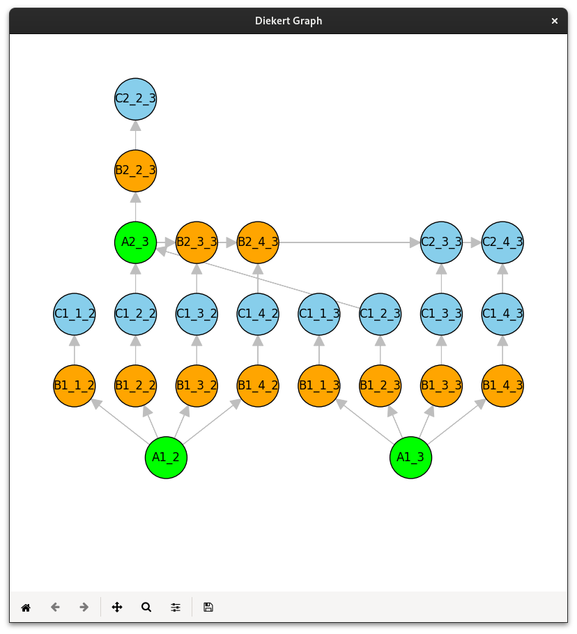
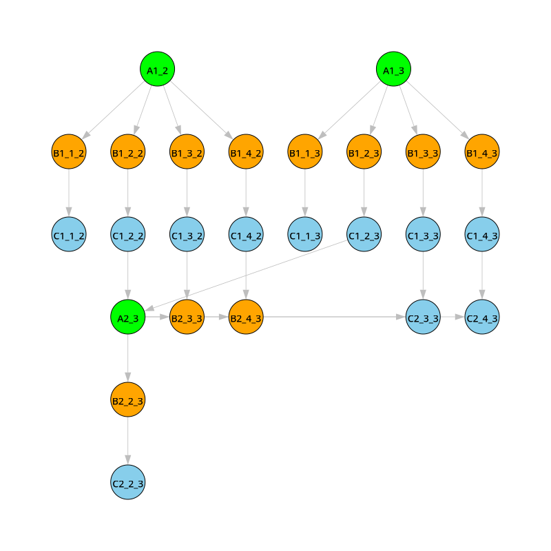

# Concurrent Gaussian Eliminator
## System requirements
- matplotlib==3.8.0
- numpy==1.26.2
- python_igraph==0.11.2
## Installation
To install any required packages, you can simply run this code:

    pip install -r requirements.txt

## Configuration
In the main directory, you can find the [config.py](config.py) file.

In this file, you can modify input, output directories; printing, exporting options and verbose option.

## How to Run
To run this program, open terminal in the same directory as [run.py](run.py) and execute this code:

    python run.py <input_file>

# Testing
To test this program with sample data, you can run program with these arguments:

    python run.py input/sample.txt

    python run.py input/sample2.txt

    python run.py input/sample3.txt

Output:
````
# sample:

Result matrix:
2.00 1.00 3.00 | 6.00
0.00 1.00 2.00 | 3.00
0.00 0.00 3.00 | 3.00

# sample2:

Result matrix:
2.00 1.00 3.00 6.00 | 12.00
0.00 1.00 2.00 3.00 | 6.00
0.00 0.00 3.00 3.00 | 6.00
0.00 0.00 0.00 0.00 | 6.00

# sample3:

Result matrix:
1.00 2.00 3.00 4.00 5.00 | 6.00
0.00 1.00 6.00 5.00 5.00 | 4.00
0.00 0.00 2.00 19.00 17.00 | 20.00
0.00 0.00 0.00 11.00 111.00 | 164.00
0.00 0.00 0.00 0.00 -481.00 | -540.00
````

Result window with a plot - *sample.txt*:



Saved plot as PNG image in *output* directory - *sample.txt*:



The program can also save the result graph in a *.dot* file.

## Input format
The input file should be in the following format:

    <size of the coefficient matrix>    # (int)
    <row 1 of the coefficient matrix>   # (float)
    <row 2 of the coefficient matrix>   # (float)
    ...
    <row n of the coefficient matrix>   # (float)
    <vector of constants>               # (float)


For example:

    3
    2.0 1.0 3.0
    4.0 3.0 8.0
    6.0 5.0 16.0
    6.0 15.0 27.0
    